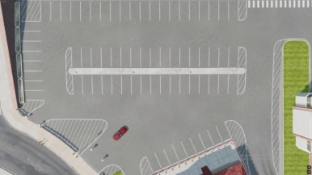
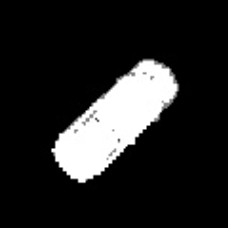

**CyberParking** 

Inteligentny system zarządzania parkingiem

z wykorzystaniem analizy obrazów 

Grupa: IO1 

Sebastian Cieślik 245787 

Juliusz Zolich 245971 

Witold Spychała 240800 

1. Wstęp 

II.1.  Cel projektu 

Celem projektu jest stworzenie systemu monitorowania parkingu firmowego. Monitoring powinien być autonomicznym systemem nadzoru parkingu. Powinien umożliwiać wjazd wyłącznie pracownikom firmy. Do realizacji projektu zdecydowaliśmy się na wykorzystanie metod analizy obrazu. 

II.2.  Założenia projektu 

Przystępując do opracowywania rozwiązań technicznych w poniższym projekcie przyjęto następujące założenia: 

1. Parking jest parkingiem firmowym. 
1. Możliwość wjazdu na parking mają tylko upoważnieni pracownicy firmy.
1. Na parkingu znajduje się 71 miejsc parkingowych.
1. Miejsca parkingowe są numerowane zgodnie z ruchem wskazówek zegara.
1. Na parkingu znajduję się bramka wjazdowa oraz wyjazdowa.
1. Możliwość wjazdu na parking posiadają pojazdy, których tablice rejestracyjne znajdują się w bazie danych. 
1. Rozpoznawanie tablic rejestracyjnych odbywa się za pomocą analizy obrazu.
1. Lokalizowanie i śledzenie pozycji pojazdów realizowane jest metodami analizy obrazu.
1. System rejestruje datę oraz czas wjazdu i wyjazdu pojazdów.
1. System monitoruje i rejestruje sytuacje niepożądane
1. Sytuacje niepożądane są zapisywane w bazie danych
1. Baza danych wykorzystuje SQLite3. 
1. System korzysta z trzech kamer: 
   1) wjazdowej, 
   1) wyjazdowej, 
   1) górnej, obrazującej cały parking z lotu ptaka. 
1. Do symulacji parkingu wykorzystywany jest symulator BeamNG.drive oraz wbudowana w niego mapa "Zachodnie Wybrzeże, USA". 
1. Przyjmujemy stałe warunki oświetlenia. 
1. Do symulacji ruchu pojazdów używamy dziesięciu wbudowanych w symulator modeli 

   samochodów. 

17. Każdy pojazd posiada unikalną tablicę rejestracyjną.
17. Każdy pojazd ma przypisane konkretne miejsce parkingowe, na którym powinien zaparkować. 
17. Wjazd na parking możliwy jest wyłącznie przez bramkę wjazdową.
17. Wyjazd z parkingu odbywa się wyłącznie przez bramkę wyjazdową.

II.3.  Znane metody detekcji pojazdów 

W Artykule **"Deep Learning Approach for Car Detection in UAV Imagery["**\[1\] ](#_page19_x33.00_y305.92)**omawiane jest wykorzystanie metod głębokiego uczenia do wykrywania pojazdów na zdjęciach z dronów. Autorzy analizują skuteczność różnych architektur sieci neuronowych, takich jak Faster R-CNN i YOLO, w rozpoznawaniu samochodów na parkingach oraz drogach. Badanie podkreśla zalety stosowania dronów w monitorowaniu ruchu i zarządzaniu przestrzenią parkingową.
II.4.  Znane metody rozpoznawania tablic rejestracyjnych

W Artykule **"Comparative Analysis of EasyOCR and TesseractOCR for Automatic License Plate Recognition using Deep Learning Algorithm"**[[2\] pr](#_page19_x33.00_y336.92)zedstawione jest porównanie dwóch narzędzi OCR, EasyOCR i TesseractOCR - w kontekście automatycznego rozpoznawania tablic rejestracyjnych. Badanie ma na celu ocenę skuteczności obu narzędzi OCR w rzeczywistych zastosowaniach, takich 

jak inteligentne parkingi. 

2. Materiały i metody 

II.1.  Makieta cyfrowa 

W celu odwzorowania warunków panujących na parkingu firmowym zdecydowaliśmy się na wykorzystanie parkingu znajdującego się na mapie "Zachodnie Wybrzeże, USA", która jest wbudowana w symulator BeamNG.drive. Do odwzorowania poruszania się pojazdów użyliśmy modeli samochodów, które również są wbudowane w symulator.

Nasz parking jest monitorowany przez 3 kamery: 

- wjazdową – monitorującą wjazd na parking, 
- wyjazdową – monitorującą wyjazd z parkingu, 
- górną – monitorującą cały parking z góry. 

II.1.1  Parking

Naszym parkingiem jest obiekt znajdujący się na mapie, posiada on 71 miejsc parkingowych, bramkę wjazdową oraz wyjazdową. Ruch pojazdów na parkingu odbywa się zgodnie z ruchem wskazówek zegara. 

4 

*Rys. 1. Widok parkingu z kamery górnej* 



*Rys. 2. Widok parkingu z góry z                           zaznaczonymi elementami parkingu* 

|Oznaczenie obszaru |Opis obszarów obrysowanych konturem|
| :-: | - |
|A |miejsca parkingowe |
|B |miejsca parkingowe |
|C |miejsca parkingowe |
|D |miejsca parkingowe |
|E |miejsca parkingowe |
|F |bramka wjazdowa |
|G |bramka wyjazdowa |

*Tabela 1  Opisy elementów znajdujących się na                                 parkingu przedstawionych na Rys. 2* 

II.1.2 Modele samochodów 

Samochody używane przez nas do odwzorowania ruchu na parkingu są wbudowane w symulator, posiadają one unikatowe numery rejestracyjne przydzielone przez nas (Ta[bela 2). Poja](#_page4_x153.00_y62.92)zdy oznaczone od 1 do 9 (Rys[. 3) ](#_page3_x0.00_y0.92)należą do pracowników firmy, którzy posiadają upoważnienie do parkowania na parkingu, ich tablice rejestracyjne będą zapisane w bazie danych. Pojazd oznaczony numerem 10 (Rys[. 3) nie na](#_page3_x0.00_y0.92)leży do pracowników parkingu, będzie wykorzystywany w celu sprawdzenia zachowania systemu w przypadku niepożądanego wjazdu, jego tablica rejestracyjna nie będzie się znajdować w bazie danych.

*Rys. 3.  Modele samochodów* 

|Nr obrazu |Model samochodu w symulatorze |Tablica rejestracyjna |
| - | :-: | - |
|1 |ETK K-Series |EL 12345 |
|2 |Cherrier Tograc |WI 4P305 |
|3 |Cherrier Vivace |PZ 24GPO |
|4 |Civetta Scintilla |RA 4597P |
|5 |ETK K-Series |KA 87R21 |
|6 |Civetta Bolide |CZ 28L12 |
|7 |ETK 800-Series |EZG 36A4 |
|8 |Autobello Stambecco |EL 56P4A |
|9 |Ibishu Hopper |GD 6T23P |
|10 |Cherrier Tograc |EBR 24R5 |

*Tabela 2. Modele samochodów z Rys.3                                                                                                                                wraz z ich tablicami rejestracyjnymi*

Prawidłowy wzór tablicy rejestracyjnej 

Przyjmujemy, że prawidłowa tablica rejestracyjna składa się z 2-3 liter odpowiadających miejscowości, oraz 4 lub 5 liter bądź cyfr. Prawidłowa tablica powinna składać się z 7 lub 8 znaków. 

*Rys. 4. Przykłady prawidłowych tablic rejestracyjnych* 

II.1.3 Kamera wjazdowa 

Obraz z kamery wjazdowej obejmuje wjazd na parking [(Rys. 5) or](#_page4_x0.00_y0.92)az obejmuje jeden samochód (Ry[s. 6-8) ](#_page4_x495.00_y454.92)Niezależnie od położenia tablicy rejestracyjnej na przedniej części samochodu oraz dokładnego miejsca zatrzymania się pojazdu, tablica jest widoczna na zdjęciach, gdy pojazd znajduję się przed bramką wjazdową. 

5 

*Rys. 5. Obraz kamery wjazdowej bez widocznego* 

*pojazdu* 



*Rys. 6. Obraz kamery wjazdowej z zatrzymanym pojazdem z tablicą rejestracyjną KA 87R21* 

*Rys. 7. Obraz kamery wjazdowej z zatrzymanym pojazdem z tablicą rejestracyjną WI 4P305* 



*Rys. 8. Obraz kamery wjazdowej z zatrzymanym pojazdem z tablicą rejestracyjną EL 56P4A* 

6 

II.1.4 Kamera wyjazdowa 

Obraz z kamery wyjazdowej obejmuje wyjazd z parkingu ([Rys. 9) or](#_page5_x33.00_y349.92)az obejmuje jeden samochód (Ry[s. 10-12). ](#_page5_x0.00_y0.92)Niezależnie od położenia tablicy rejestracyjnej na przedniej części samochodu oraz dokładnego miejsca zatrzymania się pojazdu, tablica jest widoczna na zdjęciach, gdy pojazd znajduję się przed bramką wyjazdową.

*Rys. 9. Obraz kamery wyjazdowej bez widocznego* 

*pojazdu*

*Rys. 11.  Obraz kamery wyjazdowej z zatrzymanym pojazdem z tablicą rejestracyjną WI 4P305*



*Rys.10. Obraz kamery wyjazdowej z zatrzymanym pojazdem z tablicą rejestracyjną EL 12345*

*Rys. 12. Obraz kamery wyjazdowej z zatrzymanym pojazdem z tablicą rejestracyjną EZG 36A4*

II.1.5 Kamera górna 

Obraz z kamery górnej obejmuje cały parking ([Rys. 13) or](#_page6_x0.00_y0.92)az pojazdy które się na nim znajdują [(Rys. 14).  ](#_page6_x33.00_y93.92)

7 

*Rys. 13. Widok pustego parkingu z kamery górnej* 



*Rys. 14. Widok parkingu z kamery górnej z* 

*zaparkowanymi na nim samochodami*

Kamera rejestruje poruszanie się pojazdów po parkingu, umożliwiając wykrywanie sytuacji prawidłowych lub niepożądanych na parkingu:

**Sytuacje prawidłowe:** 

1. Parkowanie pojazdu na wyznaczonym dla niego miejscu [(Rys. 15). ](#_page6_x33.00_y348.92)

*Rys. 15. Widok parkingu z kamery górnej z obrysowanymi niebieskimi prostokątami pojazdami zaparkowanymi na* 

*wyznaczonym dla nich miejscu* 

2. Wjazd na parking w wyznaczonym do tego miejscu [(Rys. 16). ](#_page6_x33.00_y577.92)

*Rys. 16. Widok parkingu z kamery górnej z obrysowanym niebieskim prostokątem samochodem stojącym prawidłowo przed bramką wjazdową* 

3. Wyjazd z parkingu w wyznaczonym do tego miejscu [(Rys.17). ](#_page7_x0.00_y0.92)

*Rys. 17. Widok parkingu z kamery górnej z obrysowanym niebieskim prostokątem samochodem stojącym prawidłowo przed bramką wyjazdową* 

**Sytuacje niepożądane:** 

1\. Parkowanie pojazdu na nie swoim miejscu parkingowym [(Rys. 18). ](#_page7_x0.00_y0.92)

*Rys. 18. Widok parkingu z kamery górnej z obrysowanym niebieskim prostokątem samochodem stojącym na miejscu nie przeznaczonym dla niego* 

II.2.  Wykorzystane narzędzia i moduły 

**BeamNG.drive** 

Jest to **zaawansowany symulator jazdy**, rozwijany przez niemieckie studio **BeamNG GmbH**, którego wykorzystaliśmy w celu odwzorowania warunków i sytuacji zbliżonych do realnego parkingu firmowego. 

**EasyOCR** 

Jest to biblioteka do rozpoznawania tekstu na obrazach (OCR - Optical Character Recognition), wykorzystywana była przez nas w celu przekształcić numery rejestracyjne pojazdów ze zdjęć na tekst cyfrowy. 

**Scikit-image filters** 

Jest to część biblioteki scikit-image, którą wykorzystujemy do przetwarzania obrazów, a konkretnie w kontekście automatycznego progowania obrazu.

**Cv2** 

Jest to biblioteka OpenCV w Python, którą wykorzystaliśmy do odczytywania wideo oraz ich obróbki, a konkretnie m.in. konwersji kolorów, binaryzacji, detekcji krawędzi, progowania.

**II.3.  Zastosowane metody** 

**II.3.1 Detekcja pojazdów wjeżdżających na parking** 

Skrypt odpowiedzialny za obsługę kamery wjazdowej (lub wyjazdowej) z parkingu implementuje system odczytu numeru rejestracyjnego pojazdów oparty na analizie wideo w czasie rzeczywistym, wykorzystując metody przetwarzania obrazu. Poniżej przedstawiono szczegółowe omówienie zastosowanych metod wraz z odpowiednimi wzorami.

**II.3.1.1. Binaryzacja obrazu – Metoda Otsu** 

W celu segmentacji obrazu i oddzielenia tablicy rejestracyjnej od tła stosowana jest metoda progowania Otsu. Wybiera ona optymalny próg **T**, który minimalizuje wariancję wewnątrzklasową:

gdzie: 

- (**q1(T), q2(T)**) – prawdopodobieństwa wystąpienia pikseli w dwóch klasach (obiekt i tło),
- (**σ21(T), σ22(T)**) – wariancje tych klas. 

Tablica rejestracyjna zostaje wyodrębniona jako obiekt o wartościach 255 (biały), a tło jako 0 (czarny):

**II.3.1.2. Etykietowanie obiektów – Segmentacja Connected Labeling[3]**

Aby zidentyfikować potencjalne obszary tablic rejestracyjnych, stosowana jest analiza spójnych składników. Każdy unikalny region obrazu oznaczony zostaje jako osobny obiekt, co pozwala na dalszą filtrację. 

**II.3.1.3. Filtracja kandydatów na tablice rejestracyjne**

Po segmentacji każdy znaleziony obiekt jest analizowany pod kątem:

- **Współczynnika proporcji**:   

`  `gdzie tablice rejestracyjne zazwyczaj mają proporcje w zakresie 2.5 – 3.5. 

- **Powierzchni (obszaru)**:   

`  `Tablice rejestracyjne przekazywane w kodzie mają obszar zazwyczaj w zakresie 5000 – 9000 pikseli, w zależności od ustawienia samochodu.

**II.3.1.4. Poprawa jakości obrazu** 

Wykorzystuje się następujące techniki poprawy jakości przed rozpoznawaniem tekstu:

- **Interpolacja dwuścienna[4[\]** do](#_page19_x33.00_y445.92)** zwiększenia rozdzielczości zaimplementowana z wykorzystaniem wzoru:   

`  `gdzie **cij** to współczynniki interpolacji. 

- **Filtracja Gaussowska do redukcji szumu**:   

`  `gdzie **σ** to odchylenie standardowe filtru. 

**II.3.1.5. OCR – Rozpoznawanie tekstu** 

Do odczytu tekstu z obrazu używana jest biblioteka EasyOCR, która wykorzystuje kombinację:

- Algorytm CRAFT (Character Region Awareness for Text Detection)[[5\] do](#_page19_x33.00_y461.92) lokalizowania obszarów tekstowych na obrazach. CRAFT analizuje regiony znaków oraz ich wzajemne relacje, co pozwala na skuteczne wykrywanie tekstu o dowolnym kształcie i orientacji 
- Convolutional Recurrent Neural Networks (CRNN)[6[\] za](#_page19_x33.00_y492.92)implementowaną z wykorzystaniem biblioteki PyTorc[h\[7\],](#_page19_x33.00_y523.92) 
- ResNet[\[8\] i](#_page19_x33.00_y538.92) VG[G\[9\] do](#_page19_x33.00_y554.92) ekstrakcji cech z obrazu. 
- Long Short-Term Memory (LSTM[)\[10\] ](#_page19_x33.00_y570.92)do modelowania sekwencji. 
- Connectionist Temporal Classification (CTC)[11[\] do](#_page19_x33.00_y585.92) dekodowania tekstu. 

**II.3.2. Detekcja pojazdów poruszających się po parkingu**

Skrypt odpowiedzialny za obsługę kamery odgórnej parkingu implementuje system monitorowania ruchu pojazdów oparty na analizie wideo w czasie rzeczywistym, wykorzystując metody przetwarzania obrazu i algorytmy śledzenia obiektów. Poniżej przedstawiono szczegółowe omówienie zastosowanych metod wraz z odpowiednimi wzorami.

**II.3.2.1. Segmentacja tła** 

W celu wykrycia obiektów poruszających się na nagraniu zastosowano modelowanie tła oparte na mieszance gaussowskiej (Gaussian Mixture Model – GMM), wykorzystywane w algorytmie **Background Subtraction MOG2[\[12\]. ](#_page19_x33.00_y616.92)**

Modelowanie tła przy użyciu GMM opisuje każdy piksel obrazu jako kombinację K rozkładów normalnych. Prawdopodobieństwo intensywności piksela **Xt** w czasie **t** wyraża się jako: 

gdzie: 

- **K** – liczba modeli Gaussa dla każdego piksela,
- **wi** – waga przypisana i-temu modelowi Gaussa, 
- **μ**i – średnia wartości intensywności dla danego modelu,
- **Σi** – macierz kowariancji opisująca rozrzut wartości.

Jeśli nowy piksel nie pasuje do żadnego z istniejących modeli, tworzy nowy model lub aktualizuje istniejący.  

**II.3.2.2. Filtracja szumów i morfologiczne przetwarzanie obrazu**

Po zastosowaniu segmentacji tła maska pierwszoplanowa zawiera szumy i artefakty. W celu ich eliminacji stosuje się: 

**Progowanie (Thresholding):**

Binarne progowanie obrazu realizowane jest według wzoru:

gdzie **T** to wartość progowa. 

**Zamykanie (Closing)**: 

Stosuje się je w celu eliminacji pustych miejsc wewnątrz obszarów obiektów:

A ∙ B = (A ⊕ B) ⊖ B 

gdzie: 

**A** – obraz wejściowy, 

**B** – element strukturalny, 

⊕ **–** dylatacja, 

⊖** – erozja. 

**II.3.2.3.** **Detekcja konturów** 

Obiekty ruchome są identyfikowane za pomocą **konturów** wyznaczanych metodą **FindContours zaimplementowaną w bibliotece openCV**[13][. ](#_page19_x33.00_y647.92)

Powierzchnia każdego obszaru otoczonego przez kontur jest obliczana za pomocą funkcji **ContourArea** która w swojej implementacji korzysta z **twierdzenia Greena**[14][. ](#_page19_x33.00_y678.92)

Następnie w celu uproszczenia reprezentacji obiektów stosuje się **dopasowanie prostokątów o minimalnym polu powierzchni** do każdego konturu, wykorzystując **minimum bounding rectangle (MBR[)**\[\] ](#_page19_x33.00_y694.92)**

**II.3.2.4. Dopasowanie obiektów i śledzenie**

Aby dopasować wykryte obiekty do wcześniej śledzonych pojazdów, stosuje się **metrykę euklidesową**, która oblicza odległość między środkami prostokątów opisujących obiekty:

gdzie: 

- (x1, y1) – środek poprzedniego obiektu, 
- (x2, y2) – środek nowo wykrytego obiektu. 

Jeśli odległość **d** jest mniejsza niż próg, obiekt jest uznawany za ten sam i jego parametry są aktualizowane. 

II.4.  Procedura rozpoznawania numeru rejestracyjnego 

pojazdu wjeżdżającego na parking 

**II.4.1. Przetwarzanie obrazu z kamery** 

Program pobiera kolejne klatki z nagrania (lub strumienia wideo) (R[ys. 19) i ko](#_page13_x33.00_y364.92)nwertuje obraz na **skalę szarości** ([Rys. 20)**.** ](#_page13_x33.00_y153.92)

14 

*Rys. 19. Obraz z kamery wjazdowej* 



*Rys. 20.  Obraz z kamery wjazdowej*                      

*skonwertowany do skali szarości* 

- Następnie stosuje metodę **Otsu** do binaryzacji obrazu (Ry[s. 21). ](#_page13_x33.00_y395.92)

*Rys. 21. Obraz zbinarnizowany za pomocą metody*                    

*progowania Otsu* 

- Wykonywane jest **etykietowanie obiektów**[6][ na ](#_page19_x33.00_y647.92)obrazie, czyli identyfikacja oddzielnych kształtów (potencjalnych tablic rejestracyjnych) (R[ys. 22). ](#_page14_x0.00_y0.92)

*Rys. 22. Wizualizacja wykrytych obiektów na obrazie wejściowym*

**II.4.2. Wykrywanie tablicy rejestracyjnej** 

- Program przeszukuje zidentyfikowane regiony (uzyskanych poprzez etykietowanie obiektów) [(Rys.22),](#_page14_x0.00_y0.92) analizując ich: 
- **Proporcje boków (aspect ratio):** Tablice charakteryzują się ustalonym stosunkiem szerokości do wysokości, wynoszącym od 2,5 do 3,5.
- **Powierzchnia (area):** Tablice mają określoną wielkość na obrazie, mieszczącą się w 

  przedziale od 5000 do 9000 pikseli. 

- Jeśli znaleziony obiekt spełnia warunki ([Rys. 23), w](#_page14_x0.00_y0.92)ydzielany jest z obrazu oraz poddawany dalszej analizie [(Rys. 24). ](#_page14_x0.00_y0.92)

*Rys. 24. Wycięty obszar z tablicą rejestracyjną *

*Rys. 23. Wizualizacja obrazu z zaznaczonym regionem, który jest* 

*identyfikowany jako tablica rejestracyjna* 

**II.4.3. Poprawa jakości obrazu** 

- Wydzielona tablica rejestracyjna zostaje **powiększona** metodą interpolacji dwuściennej, w 

*Rys. 25. Obraz tablicy rejestracyjnej powiększony metodą interpolacji dwuściennej*

celu zwiększenia czytelności znaków. ([Rys. 25) ](#_page15_x33.00_y86.92)

- Stosowany jest **filtr Gaussa**, który pomaga usunąć zakłócenia i wygładzić obraz przed analizą OCR[.(Rys. 26) ](#_page15_x33.00_y390.92)

*Rys. 26. Obraz z Rys. 25 po zastosowaniu filtru* 

*Gaussa* 

**II.4.4. Odczyt numeru rejestracyjnego (OCR)** 

- **EasyOCR** analizuje przetworzony obraz tablicy ([Rys. 26) i p](#_page15_x33.00_y390.92)róbuje odczytać tekst. 
- Program sprawdza, czy udało się poprawnie rozpoznać tablicę.

**II.4.5. Weryfikacja w bazie danych** 

- Program sprawdza, czy odczytany numer rejestracyjny znajduje się w bazie pojazdów:
- **Jeśli tak** – oznacza pojazd jako przybyły na parking, który może korzystać z parkingu.
- **Jeśli nie** – pojazd nie może korzystać z parkingu. 

II.5.  Procedura śledzenia pojazdów poruszających się po 

parkingu 

**II.5.1 Przetwarzanie obrazu z kamery** 

- Pobierana jest nowa klatka z kamery górnej ([Rys. 27). ](#_page16_x33.00_y159.92)

*Rys. 27. Obraz z kamery górnej na parking z znajdującym się na nim autem* 

Stosowany jest **detektor tła**, który tworzy **maskę ruchu pojazdów,** na podstawie różnicy **obecnej i poprzednich klatek** – obiekty poruszające się są wyodrębniane (Rys[. 28.1) ](#_page16_x0.00_y0.92)

*Rys.28.1 Maska poruszających się samochodów  Rys.28.2 Zbliżenie na samochód z rys 28.1* 

Następnie na otrzymanej masce stosujemy binaryzację progową (Ry[s. 29.1). ](#_page17_x0.00_y0.92)

*Rys.  29.1 Maska poruszających się samochodów po wykonaniu progowania Rys.29.2 Zbliżenie na samochód z rys 29.1* 

Po czym stosujemy operację morfologiczną zamknięcia. (R[ys. 30.1) ](#_page17_x0.00_y0.92)

18 

*Rys.  30.1 Maska poruszających się samochodów po wykonaniu operacji* 

*zamknięcia* 



*Rys.30.2 Zbliżenie na samochód z rys 30.1* 

Wykonujemy teraz **etykietowanie obiektów**[6][ na ](#_page19_x33.00_y647.92)masce, aby otrzymać obiekty (Ry[s. 31). ](#_page17_x437.00_y549.92)

[*Rys.  31 Obraz z kamery górnej z obrysowanymi konturami poruszających się* ](#_page17_x437.00_y549.92)

*obiektów* 

**II.5.2 Wykrywanie i filtrowanie pojazdów** 

- Kontury są filtrowane, aby odrzucić małe lub przypadkowe obiekty.
- Tworzona jest lista **wykrytych pojazdów**, zawierająca: 
- Położenie (**cx, cy**). 
- Rozmiar (**w, h**). 
- Kąt obrotu (**angle**). 

**II.5.3. Dopasowanie wykrytych pojazdów do śledzonych obiektów**

- Program próbuje dopasować nowo wykryte pojazdy do już śledzonych.
- Sprawdzana jest **odległość** między poprzednią i aktualną pozycją pojazdu.
- Jeśli pojazd nie porusza się, jego **licznik stacjonarności** wzrasta. 
- Jeśli przekroczy próg (**20 klatek**), sprawdzane jest, czy pojazd znajduje się w miejscu parkingowym, po czym zapisywana jest jego ostatnia lokalizacja. 

**II.5.4. Rejestrowanie nowych pojazdów** 

- Jeśli nowy pojazd zostanie wykryty w wcześniej ustawionej strefie **wjazdowej na parking**, program pobiera numer rejestracyjny najnowszego samochodu z bazy (ostatni przekazany do bazy od wątku obsługującego kamerę wjazdową) i rozpoczyna śledzenie. 

**II.5.5. Wykrywanie opuszczających pojazdów** 

- Jeśli pojazd znajdzie się w wcześniej ustawionej strefie **wyjazdowej z parkingu**, program może oznaczyć go jako opuszczający parking i usunąć z listy pojazdów śledzonych.
3. Wyniki 

W ramach realizacji projektu „Inteligentny system zarządzania parkingiem z wykorzystaniem analizy obrazów” udało się skutecznie wdrożyć i przetestować kluczowe funkcjonalności systemu takie jak:

- System poprawnie rozpoznaje samochody wjeżdżające na parking oraz monitoruje ich pozycję.
- Detekcja tablic rejestracyjnych działa poprawnie i umożliwia identyfikację pojazdów z bazy danych.
- System rejestruje zdarzenia, takie jak wjazdy i wyjazdy, oraz wykrywa nieprawidłowe zachowania takie jak parkowanie na niewłaściwym miejscu.

Słabe Strony naszego systemu:  

- Algorytm odpowiedzialny za obsługę bramek wjazdowych parkingu wymaga wysokiego nakładu  mocy obliczeniowej do odczytywania znaków z tablicy rejestracyjnej co powoduje długie czasu odczytu pojedynczych klatek: 0.3 do 1.2s na pojedynczą klatkę. 
4. Wnioski 

W ramach realizacji projektu „Inteligentny system zarządzania parkingiem z wykorzystaniem analizy obrazów” udało się skutecznie zrealizować zakładane założenia projektowe.

Możliwością optymalizacji problemów byłoby zastosowanie lepszego sprzętu bądź zastosowanie bardziej zaawansowanych algorytmów OCR mogłoby pomóc z czasem trwania rozpoznania numerów rejestracyjnych. 

Podsumowując, projekt spełnia swoje podstawowe założenia. Dalszy rozwój systemu powinien skupić się na optymalizacji wydajności oraz poprawie jakości detekcji w trudnych warunkach. 

5. Dodatek 

Przypisy: 

1. **Zhou, Y., Zhang, Y., & Wang, J. (2017).** Deep learning approach for car detection in UAV imagery. *Remote Sensing, 9*(4), 312. [\[Google Scholar\] \[Artykuł\] ](https://www.mdpi.com/2072-4292/9/4/312)
1. **Vedhaviyassh, D. R., Sudhan, R., Saranya, G., Safa, M., & Arun, D.** **(2022).** Comparative Analysis of EasyOCR and TesseractOCR for Automatic License Plate Recognition using Deep Learning Algorithm. [\[Google Scholar\] ](https://scholar.google.com/scholar?hl=pl&as_sdt=0%2C5&q=%22Comparative+Analysis+of+EasyOCR+and+TesseractOCR+for+Automatic+License+Plate+Recognition+Using+Deep+Learning+Algorithm%22&btnG=)[\[Artykuł\]](https://ieeexplore.ieee.org/abstract/document/10009215?casa_token=yxLQGb3YbqYAAAAA:_ide0P3NyMh6iEfvRqEhSHa6LNbQY83Y3OJUBV_ZmOryhjIRys9HWpMqBjqiAjfrMzgiR4sHdQ) 
1. **Sarfraz, M. S., Shahzad, M. A., & Khan, S. A. (2015)**. Improved automatic license plate recognition (ALPR) system based on single pass connected component labeling (CCL) and region property function. W *2015 12th International Conference on High-capacity Optical Networks and Enabling/Emerging Technologies (HONET)* (s. 1–5).[ \[Google Scholar\] ](https://scholar.google.com/scholar?hl=pl&as_sdt=0%2C5&q=Improved+Automatic+License+Plate+Recognition+%28ALPR%29+system+based+on+single+pass+Connected+Component+Labeling+%28CCL%29+and+reign+property+function&btnG=)[\[Artykuł\]](https://ieeexplore.ieee.org/abstract/document/7293378?casa_token=vDsa-zFVNshttps:%2F%2Fieeexplore.ieee.org%2Fabstract%2Fdocument%2F7293378%3Fcasa_token%3DvDsa-zFVNs8AAAAA:mRflatD-1TZF2YyHKlzGmXEK8gUoXlO5pYFb59DQGfc98_AV8fWuO2rrtkwQJ_OdDE7CXS8HuJM8AAAAA:mRflatD-1TZF2YyHKlzGmXEK8gUoXlO5pYFb59DQGfc98_AV8fWuO2rrtkwQJ_OdDE7CXS8HuJM) 
1. Interpolacja dwuścienna [[Wikipedia\] ](https://en.wikipedia.org/wiki/Bicubic_interpolation)
1. **Youngmin B., Bado L., Dongyoon H., Sangdoo Y., Hwalsuk L. (2019)**. Character Region Awareness for Text Detection [\[Artykuł\]](https://arxiv.org/abs/1904.01941)
1. **Baoguang S., Xiang B., Cong Y. (2015**). An End-to-End Trainable Neural Network for Image-based 

   Sequence Recognition and Its Application to Scene Text Recognition [Arty[kuł\]](https://arxiv.org/abs/1507.05717)

7. **Pytorch[ \[Strona\] ](https://pytorch.org/)[\[Wikipedia\]](https://pl.wikipedia.org/wiki/PyTorch)**
7. **Kaiming H., Xiangyu Z., Shaoqing R., Jian S. (2015)**. Deep Residual Learning for Image Recognition [[Artykuł\]](https://arxiv.org/abs/1512.03385)
7. **Alexis C., Holger S., Loïc B., Yann** **L. (2017**). Very Deep Convolutional Networks for Text Classification [A[rtykuł\]](https://arxiv.org/abs/1606.01781)
7. **Hochreiter S., Schmidhuber J. (1997).** LONG SHORT-TERM MEMO[RY \[Artykuł\]](https://www.bioinf.jku.at/publications/older/2604.pdf)
7. **Grave A., Fernández S., Gomez F., Schmidhuber J**. (2006). Connectionist Temporal Classification: Labelling Unsegmented Sequence Data with Recurrent Neural Networks [\[Artykuł\]](https://www.cs.toronto.edu/~graves/icml_2006.pdf)
7. **Stauffer, C., & Grimson, W. E. L. (1999).** *An improved adaptive background mixture model for real-time tracking with shadow detection*. ResearchGate. [G[oogle Scholar\] \[Ar](https://scholar.google.com/scholar?hl=pl&as_sdt=0%2C5&q=An+improved+adaptive+background+mixture+model+for+real-time+tracking+with+shadow+detection&btnG=)[tykuł\] ](https://www.researchgate.net/publication/2557021_An_Improved_Adaptive_Background_Mixture_Model_for_Realtime_Tracking_with_Shadow_Detection)
7. **Kass, M., Witkin, A., & Terzopoulos, D. (1988).** *Snakes: Active contour models*. International Journal of Computer Vision, 1(4), 321–331. [\[Google Scholar\] \[Artykuł\] ](https://www.sciencedirect.com/science/article/abs/pii/0734189X85900167)
7. **Twierdzenie Greena** [\[Wikipedia\]](https://pl.wikipedia.org/wiki/Twierdzenie_Greena)
7. **Broggi, A., Bertozzi, M., Fascioli, A., & Conte, G. (1999).** Vehicle recognition and tracking from road image sequences. *IEEE Transactions on Vehicular Technology, 48*(1), 301–318. [G[oogle Scholar\] \[Ar](https://scholar.google.com/scholar?hl=pl&as_sdt=0%2C5&q=Vehicle+recognition+and+tracking+from+road+image+sequen&btnG=)[tykuł\] ](https://ieeexplore.ieee.org/abstract/document/740109?casa_token=_f2q3w4Wp64AAAAA:jbwhpWssKXevNxtTP6C1u9IfI4XWZx9-NJ_WgYrrPYUX3L-tF1oVPn-pQiDfWzS2qbAWQmxBKqA)

Ustawienia kamery wjazdowej, wyjazdowej oraz górnej w symulatorze BeamNG.drive 

|Nazwa parametru |Wartość |
| - | - |
|Pole widzenia |60 ° |
|Prędkość kamery |32\.5 |
|Przechył |0 ° |
|Pora dnia |8:52|
|Pozycja słońca |183 |

*Tabela 3. Ustawienia dla kamer w symulatorze* 

**Spis tabel** 

[Tabela 1. Opisy elementów znajdujących się na parkingu przedstawionych na Rys. 2 ](#_page3_x151.00_y337.92)[Tabela 2. Modele samochodów z Rys.3  wraz z ich tablicami rejestracyjnymi](#_page4_x153.00_y62.92)

[Tabela 3. Ustawienia dla kamer w symulatorze](#_page20_x157.00_y111.92)

**Spis rysunków** 

[Rys. 1. Widok parkingu z kamery górnej ](#_page3_x33.00_y82.92)

[Rys. 2. Widok parkingu z góry z zaznaczonymi elementami parkingu ](#_page3_x0.00_y0.92)

[Rys. 3. Modele samochodów ](#_page3_x0.00_y0.92)

[Rys. 4. Przykłady prawidłowych tablic rejestracyjnych ](#_page4_x33.00_y338.92)

[Rys. 5. Obraz kamery wjazdowej bez widocznego pojazdu](#_page4_x0.00_y0.92)

[Rys. 6. Obraz kamery wjazdowej z zatrzymanym pojazdem z tablicą rejestracyjną KA 87R21 ](#_page4_x495.00_y454.92)[Rys. 7. Obraz kamery wjazdowej z zatrzymanym pojazdem z tablicą rejestracyjną WI 4P305 ](#_page5_x0.00_y0.92)[Rys. 8. Obraz kamery wjazdowej z zatrzymanym pojazdem z tablicą rejestracyjną EL 56P4A ](#_page5_x33.00_y61.92)[Rys. 9. Obraz kamery wyjazdowej bez widocznego pojazdu ](#_page5_x33.00_y349.92)

[Rys. 10. Obraz kamery wyjazdowej z zatrzymanym pojazdem z tablicą rejestracyjną EL 12345 Rys. 11. Obraz kamery wyjazdowej z zatrzymanym pojazdem z tablicą rejestracyjną WI 4P305 Rys. 12.  Obraz kamery wyjazdowej z zatrzymanym pojazdem z tablicą rejestracyjną EZG 36A4 ](#_page5_x0.00_y0.92)[Rys. 13. Widok pustego parkingu z kamery górnej ](#_page6_x0.00_y0.92)

[Rys. 14. Widok parkingu z kamery górnej z zaparkowanymi na nim samochodami](#_page6_x33.00_y93.92)

[Rys. 15. Widok parkingu z kamery górnej z obrysowanymi niebieskimi prostokątami pojazdami zaparkowanymi na wyznaczonym dla nich miejscu ](#_page6_x33.00_y348.92)

[Rys. 16. Widok parkingu z kamery górnej z obrysowanym niebieskim prostokątem samochodem stojącym prawidłowo przed bramką wjazdową ](#_page6_x33.00_y577.92)

[Rys. 17. Widok parkingu z kamery górnej z obrysowanym niebieskim prostokątem samochodem stojącym prawidłowo przed bramką wyjazdową ](#_page7_x0.00_y0.92)

[Rys. 18. Widok parkingu z kamery górnej z obrysowanym niebieskim prostokątem samochodem stojącym na miejscu nie przeznaczonym dla niego ](#_page7_x0.00_y0.92)

[Rys. 19. Obraz z kamery wjazdowej ](#_page13_x33.00_y364.92)

[Rys. 20. Obraz z kamery wjazdowej skonwertowany do skali szarości](#_page13_x33.00_y153.92)

[Rys. 21. Obraz zbinarnizowany za pomocą metody progowania Otsu](#_page13_x33.00_y395.92)

[Rys. 22. Wizualizacja wykrytych obiektów na obrazie wejściowym ](#_page14_x0.00_y0.92)

[Rys. 23. Wizualizacja obrazu z zaznaczonym regionem, który jest identyfikowany jako tablica rejestracyjna Rys. 24. Wycięty obszar z tablicą rejestracyjną z obrazu wejściowego](#_page14_x0.00_y0.92)

[Rys. 25. Obraz tablicy rejestracyjnej powiększony metodą interpolacji dwuściennej](#_page15_x33.00_y86.92)

[Rys. 26. Obraz z Rys. 25 po zastosowaniu filtru Gaussa](#_page15_x33.00_y390.92)

[Rys. 27. Obraz z kamery górnej na parking z znajdującym się na nim autem ](#_page16_x33.00_y159.92)[Rys. 28.1 Maska poruszających się samochodów](#_page16_x0.00_y0.92)

[Rys. 28.2 Zbliżenie na samochód z rys 28.1 ](#_page16_x0.00_y0.92)

[Rys. 29.1 Maska poruszających się samochodów po wykonaniu progowania](#_page17_x0.00_y0.92)

[Rys. 29.2 Zbliżenie na samochód z rys 29.1 ](#_page17_x0.00_y0.92)

[Rys. 30.1 Maska poruszających się samochodów po wykonaniu operacji zamknięcia ](#_page17_x0.00_y0.92)[Rys. 30.2 Zbliżenie na samochód z rys 30.1 ](#_page17_x33.00_y327.92)

[Rys. 31 Obraz z kamery górnej z obrysowanymi konturami poruszających się obiektów](#_page17_x437.00_y549.92)
22 
